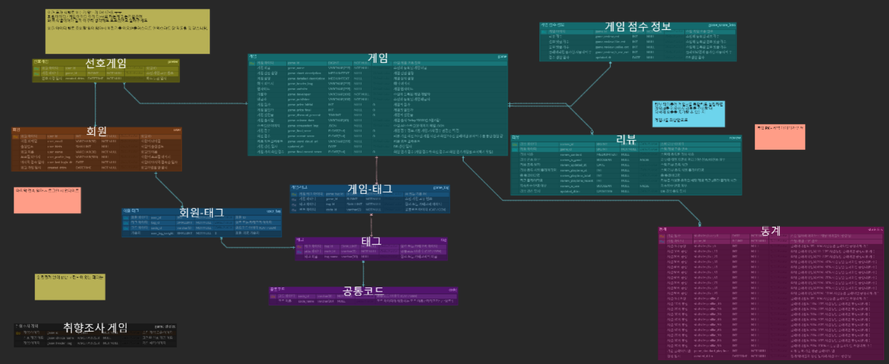
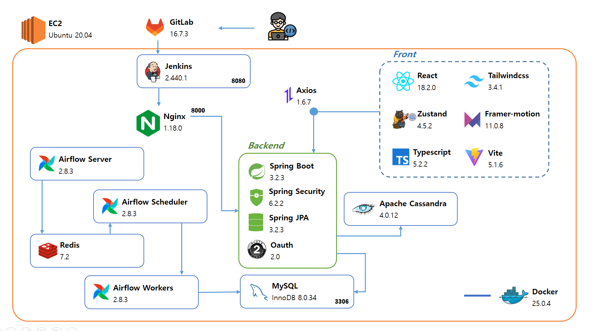
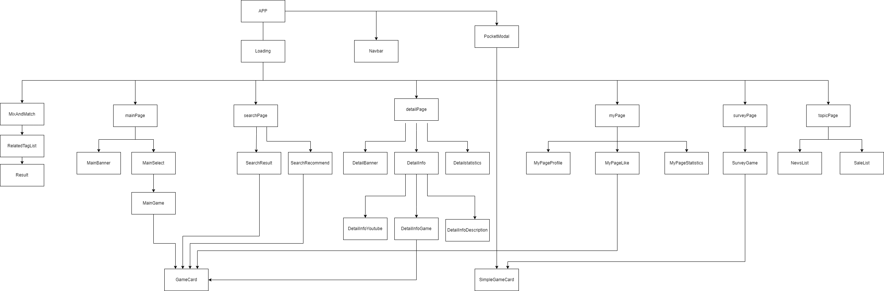

# 🎮GA:ME(껨미)🎮
## 서비스 소개
###  GA:ME(껨미)❗ 나에게 FIT한 게임을 추천해줘❗❗❗

__*"게임(GAME)과 나(ME)를 연결해주는 껨미"*__

GA:ME는 기존의 게임 사이트인 스팀의 정보를 기반으로 사용자의 취향에 딱 맞는 게임을 추천하는 서비스입니다.

GA:ME만의 추천 알고리즘으로 게임 별 자체 점수를 산정하고 
 
이를 바탕으로 인기 / 요즘인기 / 사용자 맞춤 / 조합 게임을 추천 합니다.

## 추천 알고리즘
#### 점수 산정 기준 (자체 점수 로직)
-  게임 가치 점수 (game_fina)
    - 리뷰 개수 (80%)
       -  $\left( \frac{\log(리뷰개수^2 + 1)}{8 + \log(리뷰개수^2 + 1)} \right) \times 100$
  
    - 댓글 선호도 (=우리만의 평점) (10%)
        - $\left( \frac{{\text{{ReviewLikeCnt}}}}{{\text{{ReviewLikeCnt}} + \text{{ReviewUnlikeCnt}}}} \right ) \times 100$
  
    - 댓글 작성 이후 플레이타임 증가한 사용자 비율 (10%)
      - $\left( \frac{{\text{{증가한 사용자}}}}{{\text{{전체 사용자}}}} \right) \times 100$
     
      - $\left( \frac{\log(\text{{플레이타임 증가한 리뷰 개수}} + 1)}{5 + \log(\text{{플레이타임 증가한 리뷰 개수}} + 1)} \right) \times 100$
      - 증가한 사용자: 
        
        $\left( \frac{{\text{{현재 플래이타임}} - \text{{댓글쓴 당시 시간}}}}{{\text{{댓글 쓴 당시 시간}}}} \right) \times 100 \geq 30\%$ 인 사용자

- 요즘 게임 점수
    - 최근 게임 점수:
        - ${{game\_recent\_score}} = \left( \left(1 - \frac{1}{{1 + \log(\text{{총 최근 게임 시간}} + 1)}}\right) + \left(1 - \frac{1}{{1 + \log(\text{{최근 게임 플레이한 유저}} \times 100 + 1)}}\right) \right) \times 100$
    

    - 최종 최근 게임 점수:
      - ${{game\_final\_recent\_score}} = \text{{ game\_final\_score}} \times 0.6 + \text{{game\_recent\_score}} \times 0.4$

## 서비스 특장점
#### 빅데이터
- 게임데이터 약 16만개
- 리뷰 개수 약 1000만개
-  사용자의 행동을 추적하고 행동을 로그로 관리
- 에어플로우에서 3개로 설계된 dags 안에 각각 태스크를 2개, 4개, 2개로 구성하여 데이터 플로우를 관리
- 에어 플로우에서 데이터 업데이트 주기를 1주일로 스케쥴링

#### 추천
- 독자적인 추천 알고리즘을 통해 게임 자체의 점수를 매김(리뷰 개수 / 리뷰 긍-부정도 / 플레이타임 증가율)

1. 사용자 행동 패턴을 기반으로 **사용자 취향 맞춤 게임 추천**
2. GA:ME만의 자체 점수를 기반으로 **인기 게임 추천**
3. 자체점수와 최신 점수를 기반으로 **요즘 인기 게임 추천**
4. 최소2개 이상, 5개 이하 게임들을 태그 기반으로 조합하여 **유사한 게임 추천**

#### 통계
- 플레이 타임 별 리뷰 긍정도를 통해 구간별 게임 만족도 그래프 제공
- 사용자 행동 패턴 기반 가중치 부여로 개인 관심 태그 비율 그래프 제공

#### 다양한 게임 관련 정보 제공
- 기본적인 게임 정보(제목, 가격, 상세 정보, 할인율)
- 유튜브 API를 활용한 관련 영상 제공
- 할인율 별 게임 할인 정보 제공
- Selenium을 활용한 개인 선호 게임 별 관련 뉴스 제공

#### 사용자 친화적인 UI / UX
- 사용자 편의성을 고려한 드래그 앤 드롭 기능(포켓에 담기 기능)
- 사용 가능한 컨텐츠를 보기 쉽게 알려주는 애니메이션 효과
- 로딩시간을 보완할 애니메이션이 적용된 스피너
- 게임 추천 서비스의 분위기에 맞는 반응형 페이지네이션 footer
- 게임 도메인의 무드에 맞는 전체적인 페이지 디자인

## 구현 페이지 & 기능 소개

### 1. 카카오 로그인

### 2. 메인 페이지
- 메인 배너: 자체 평가 기준 + 모든 사용자 패턴 기준 '최신' 인기 게임 추천
- 인기 게임: 자체 평가 기준에 따른 인기 게임 추천

- 취향 저격: 사용자 행동 패턴에 따른 인기 게임 추천
- 태그 기반 게임 목록 필터링

### 3. 디테일 페이지
- 스팀 API 기반 게임 디테일 정보 제공(가격, 개발자, 할인 정보 등)
- 유튜브 API 기반 게임 공식 트레일러 영상 제공

- 스팀 API 리뷰 내 플레이타임 기반 시간 별 만족도 그래프 제공
- 스팀 API 리뷰 내 키워드 기반 워드 클라우드 제공

### 4. 게임명 검색

### 5. Mix&Match
- 사용자 지정 N개 게임에 대한 태그 기반 게임 추천

### 6. Hot Topic
- 스팀 게임 세일 정보 제공
- 사용자 선호 태그 기반 게임의 뉴스 정보

### 7. 마이페이지
- 사용자 선호 태그 및 가중치 정보
- 사용자 선호 게임 목록

### 8. 사용자 행동 패턴 로깅 
- 사용자 행동 패턴에 따른 가중치 판단 및 가치 반영

## 트러블 슈팅

1. Steam API 가공
   - 일관성 없는 데이터
     -> 꼼꼼한 예외 처리
   - 짧은 시간 동안 반복적인 요청으로 인한 접근 거부
     -> sleep(), 재시도 로직
 

**=> 160,000개의 게임 + 30,000,000개 이상의 리뷰 데이터 저장!**

2. 느린 데이터 처리 속도
    - 시간당 리뷰 데이터 처리속도 약 10만 개
     -> Airflow의 Task 병렬 처리 기능을 이용하여 데이터 처리 속도 향상
 

**=> 12개의 병렬 처리로 시간당 약 70만 개 이상의 리뷰 데이터 처리!**

3.  배포 서버 용량 부족 
    - 서버 / DB 배포 및 대용량 데이터 처리로 인한 서버 부하 증가
     -> Airflow의 배치 병렬 처리 조절을 통해 요청 속도 조절
     -> Cassandra DB에서 Review의 PK를 파티셔닝하여 조회 시 부하 감소
     -> EC 2 서버에 SWAP 메모리를 적용하여 여유 용량 확보

4. JPA N+1 문제
   - 복합키 구조와 정규화로 인한 오랜 조회 시간 및 N+1 문제 -> QueryDSL 사용으로 조회 시간을 향상 및 N+1 문제 해결
   

__=> 기존 약 5분 가량 걸리던 조회 시간이 "1.5초"로 단축!__
   

## 기술 스택
**[ BE ]** 
- SpringBoot 
- JPA 
- Spring Security 
- QueryDSL

**[ FE ]** 
- React 
- TypeScript 
- Zustand

**[ INFRA ]** 
- EC2
- Docker 
- NGINX
- Docker-Compose
**[ DB ]**
- Cassandra
- Redis 
- Mysql
- Postgres

**[ DATA ]** 
- Selenium

**[ SCHEDULING & FLOW ]**
- Airflow

## 기술 특이점
1. Aifrlow를 이용한 스팀 게임 데이터 가공
   
2. 자체적인 추천 알고리즘 개발

3. 카산드라를 이용한 사용자 행동 패턴 가중치 로그 관리

4. Aifrlow 스케줄러를 이용한 일주일마다 게임 최신화 & 리뷰 데이터 분석 ( 점수 계산 및 워드 클라우드 ) 구현

5. Nginx & Jenkins를 이용한 무중단 배포 구현

6. Nginx(리버스 프록시)를 이용한 보안 강화

7. Selenium을 사용해 회원의 관심 게임 뉴스를 실시간으로 크롤링

8. 감정 알고리즘(NLTK)을 사용한 댓글 긍/부정 판단 - 정확도 향상을 위해 영어 댓글 사용

## ERD

## 시스템 아키텍쳐

- **Nginx**
  - 리버스 프록시로 HTTPS 적용과 서버로의 요청 전달
  - 카카오 로그인 요청 허가
- **Jenkins**
  -  지속적으로 통합 서비스를 배포, 무중단 배포 적용
- **Airflow**
  - 워크플로우 오픈 소스 플랫폼 
  - 프로그래밍 방식으로 워크플로우를 작성, 예약 및 모니터링
  - DAG 기반 파이프라인을 사용하기 위해 선택
- **Redis**
    - Airflow에서 사용되는 캐시 기반 NoSQL 데이터베이스
- **Oauth**
  - 카카오 API를 활용한 로그인
- **Cassandra**
  - 사용자 행동 패턴 로깅 및 조회
  - 스팀 API 기반 리뷰 정보 분산 저장 및 조회
  
- **Selenium**
  - 사용자의 선호 태그 기반으로 실시간 뉴스 크롤링
## 컴포넌트 설계도

## 프론트 폴더 구조
📦src
 - ┣ 📂components
 - ┃ ┣ 📂commonUseComponents
 - ┃ ┃ ┣ 📜CallbackComponent.tsx
 - ┃ ┃ ┣ 📜GameCard.module.css
 - ┃ ┃ ┣ 📜GameCard.tsx
 - ┃ ┃ ┣ 📜Loading.tsx
 - ┃ ┃ ┣ 📜Navbar.module.css
 - ┃ ┃ ┣ 📜Navbar.tsx
 - ┃ ┃ ┣ 📜Poket.module.css
 - ┃ ┃ ┣ 📜Poket.tsx
 - ┃ ┃ ┗ 📜SimpleGameCard.tsx
 - ┃ ┣ 📂detailComponents
 - ┃ ┃ ┣ 📜BackButton.tsx
 - ┃ ┃ ┣ 📜Detail.module.css
 - ┃ ┃ ┣ 📜DetailBanner.module.css
 - ┃ ┃ ┣ 📜DetailBanner.tsx
 - ┃ ┃ ┣ 📜DetailInfo.module.css
 - ┃ ┃ ┣ 📜DetailInfo.tsx
 - ┃ ┃ ┣ 📜InfoDescription.module.css
 - ┃ ┃ ┣ 📜InfoDescription.tsx
 - ┃ ┃ ┣ 📜InfoDetailDesc.module.css
 - ┃ ┃ ┣ 📜InfoDetailDesc.tsx
 - ┃ ┃ ┣ 📜InfoGame.module.css
 - ┃ ┃ ┣ 📜InfoGame.tsx
 - ┃ ┃ ┣ 📜InfoScreenshot.module.css
 - ┃ ┃ ┣ 📜InfoScreenshot.tsx
 - ┃ ┃ ┣ 📜InfoYoutube.module.css
 - ┃ ┃ ┣ 📜InfoYoutube.tsx
 - ┃ ┃ ┣ 📜Statistics.module.css
 - ┃ ┃ ┣ 📜Statistics.tsx
 - ┃ ┃ ┣ 📜WordCloud.module.css
 - ┃ ┃ ┗ 📜WordCloud.tsx
 - ┃ ┣ 📂HotTopicComponents
 - ┃ ┃ ┣ 📜HotTopicButton.module.css
 - ┃ ┃ ┣ 📜NewsButton.tsx
 - ┃ ┃ ┣ 📜NewsCard.module.css
 - ┃ ┃ ┣ 📜NewsCard.tsx
 - ┃ ┃ ┣ 📜NewsList.module.css
 - ┃ ┃ ┣ 📜NewsList.tsx
 - ┃ ┃ ┣ 📜SaleButton.tsx
 - ┃ ┃ ┣ 📜SaleComponent.module.css
 - ┃ ┃ ┣ 📜SaleComponent.tsx
 - ┃ ┃ ┣ 📜SalesList.tsx
 - ┃ ┃ ┣ 📜Title.module.css
 - ┃ ┃ ┗ 📜Title.tsx
 - ┃ ┣ 📂mainComponents
 - ┃ ┃ ┣ 📜Banner.module.css
 - ┃ ┃ ┣ 📜Banner.tsx
 - ┃ ┃ ┣ 📜Game.module.css
 - ┃ ┃ ┣ 📜Game.tsx
 - ┃ ┃ ┣ 📜Select.module.css
 - ┃ ┃ ┗ 📜Select.tsx
 - ┃ ┣ 📂mixAndMatchComponents
 - ┃ ┃ ┣ 📜CombinationList.tsx
 - ┃ ┃ ┣ 📜MixandMatch.module.css
 - ┃ ┃ ┣ 📜RelatedTagList.tsx
 - ┃ ┃ ┣ 📜Result.tsx
 - ┃ ┃ ┣ 📜SearchGameList.tsx
 - ┃ ┃ ┣ 📜Title.module.css
 - ┃ ┃ ┗ 📜Title.tsx
 - ┃ ┣ 📂MyPageComponents
 - ┃ ┃ ┣ 📜Like.tsx
 - ┃ ┃ ┣ 📜MyPage.module.css
 - ┃ ┃ ┣ 📜NoUsedTagList.tsx
 - ┃ ┃ ┣ 📜Profile.tsx
 - ┃ ┃ ┗ 📜Statistics.tsx
 - ┃ ┣ 📂searchComponents
 - ┃ ┃ ┣ 📜Result.tsx
 - ┃ ┃ ┣ 📜Search.module.css
 - ┃ ┃ ┣ 📜SearchBox.tsx
 - ┃ ┃ ┣ 📜Title.module.css
 - ┃ ┃ ┗ 📜Title.tsx
 - ┃ ┗ 📂SurveyComponents
 - ┃ ┃ ┣ 📜SurveyGame.module.css
 - ┃ ┃ ┗ 📜SurveyGame.tsx
 - ┣ 📂pages
 - ┃ ┣ 📜Detail.tsx
 - ┃ ┣ 📜HotTopic.tsx
 - ┃ ┣ 📜Main.tsx
 - ┃ ┣ 📜MixAndMatch.tsx
 - ┃ ┣ 📜MyPage.tsx
 - ┃ ┣ 📜Search.tsx
 - ┃ ┣ 📜Survey.tsx
 - ┃ ┗ 📜text.module.css
 - ┣ 📂stores
 - ┃ ┣ 📜currentPage.tsx
 - ┃ ┣ 📜DetailStore.tsx
 - ┃ ┣ 📜hotTopicStore.tsx
 - ┃ ┣ 📜likeStore.tsx
 - ┃ ┣ 📜mainStore.tsx
 - ┃ ┣ 📜mixAndMatchStore.tsx
 - ┃ ┣ 📜myPageStore.tsx
 - ┃ ┣ 📜poketStore.tsx
 - ┃ ┣ 📜searchStore.tsx
 - ┃ ┣ 📜surveyStore.tsx
 - ┃ ┗ 📜userStore.tsx
 - ┣ 📂url
 - ┃ ┗ 📜api.tsx
 - ┣ 📜App.css
 - ┣ 📜App.tsx
 - ┣ 📜index.css
 - ┣ 📜main.tsx
 - ┗ 📜vite-env.d.ts

## 팀원 소개 
|이상훈 [팀장]|김하영|장현욱|김윤민|정라엘|박종국|
|---|---|---|---|---|---|
|||||||
|**[ BE & FE ]**|**[ BE & FE ]**|**[ FE ]**|**[ BE & FE ]**|**[ BE & FE ]**|**[ BE & FE ]**|

### 팀원 역할
- **이상훈**
  - Airflow
    - 리뷰 데이터 수집
    - 리뷰 데이터 기반 게임 자체 점수 로직 구현
  - Yotube API & 리뷰 데이터 기반 WordCloud 기능 구현

- **김하영**
  - Airflow
    - 게임 데이터 수집
  - 자체점수 기반 유저 취향 게임 추천 기능 구현
  - 사용자 지정 게임에 대한 태그 기반 게임 추천 기능 구현
  
- **장현욱**
  - 홈페이지 로고 디자인
  - 공통 컴포넌트 개발
  - 메인 페이지 개발

- **김윤민**
  - CI / CD
    - Nginx와 Jenkins를 이용한 자동 배포 구현
    - 무중단 배포 구현
  - Selenium을 이용한 사용자 관심 게임 뉴스 크롤링 
  - Steam API 기반 게임 세일 정보 제공 
   
- **정라엘**
    - Cassandra
      - 사용자 패턴 로그 기록
    - 사용자 패턴 기반 가중치 계산 기능 구현
    - 카카오 API 기반 로그인 구현
  
- **박종국**
    - CI / CD
      - Nginx와 Jenkins를 이용한 자동 배포 구현
    - 사용자 선호 태그 통계 그래프 제공
    - 사용자 취향 조사 API 및 화면 구현
